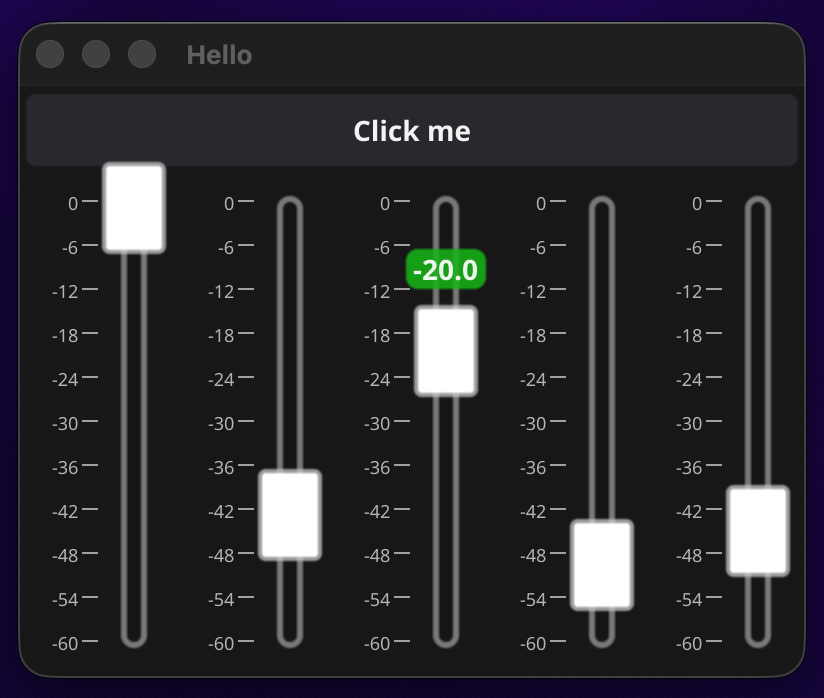

# fyne-mixer-fader

[](https://pkg.go.dev/github.com/kamauz/fyne-mixer-fader)
[](https://goreportcard.com/report/github.com/kamauz/fyne-mixer-fader)
[](LICENSE)

A DAW-style vertical fader widget for [Fyne](https://fyne.io/) v2. Supports linear and logarithmic response curves, per-widget theming, and standard mixer interactions.

<!--  -->

## Installation

```sh
go get github.com/kamauz/fyne-mixer-fader
```

Requires Go 1.21+ and Fyne v2.7.2+.

## Usage

```go
import (
    "github.com/kamauz/fyne-mixer-fader/mixerfader"
    "github.com/kamauz/fyne-mixer-fader/mixerfader/enums"
    "github.com/kamauz/fyne-mixer-fader/mixerfader/theme/config"
)

themeConfig := config.ThemeConfig{
    TrackConfig: config.TrackStyle{
        Color:           color.NRGBA{R: 22, G: 22, B: 22, A: 255},
        ZeroDBLineColor: color.NRGBA{R: 255, G: 200, B: 0, A: 180},
        SideScaleColor:  color.NRGBA{R: 250, G: 250, B: 250, A: 255},
        ShadowColor:     color.NRGBA{R: 200, G: 200, B: 200, A: 140},
        ShadowOffset:    3,
        Width:           7,
        Radius:          3.5,
        LabelWidth:      50,
        LabelHeight:     18,
    },
    ThumbConfig: config.ThumbStyle{
        ShowLabel:       true,
        ShowLabelBox:    true,
        Color:           color.NRGBA{R: 255, G: 255, B: 255, A: 220},
        LabelBoxColor:   color.NRGBA{R: 22, G: 180, B: 22, A: 220},
        LabelColor:      color.NRGBA{R: 250, G: 250, B: 250, A: 240},
        BorderColor:     color.NRGBA{R: 200, G: 200, B: 200, A: 190},
        MiddleLineColor: color.NRGBA{R: 0, G: 0, B: 0, A: 255},
        Width:           32,
        Height:          46,
    },
    PaddingTop:    10,
    PaddingBottom: 10,
    PaddingLeft:   30, // space for the dB scale labels
}

fader := mixerfader.New(0, enums.TapeTypeLogarithmic, themeConfig, func(value float64) {
    fmt.Printf("%.1f dB\n", value)
})
```

For the full API reference and architecture overview, see [DOCS.md](DOCS.md).

## Interactions

| Action     | Result                                |
| ---------- | ------------------------------------- |
| Drag       | Move thumb, update value continuously |
| Tap        | Jump to tapped position               |
| Double-tap | Reset to default value (0 dB)         |
| Hover      | Show value label above thumb          |

## Contributing

Bug reports and pull requests are welcome via [GitHub Issues](https://github.com/kamauz/fyne-mixer-fader/issues).

When submitting a PR: add tests for any new tape logic, and include a screenshot for visual changes.

## License

[Apache 2.0](LICENSE)
